# claude-desktop-buddy-cyd

ESP32 CYD (ESP32-2432S028R, 2.8" "Cheap Yellow Display") fork of
[anthropics/claude-desktop-buddy](https://github.com/anthropics/claude-desktop-buddy).
Same Nordic-UART BLE protocol as upstream — pairs with the **Hardware
Buddy** window in Claude desktop exactly the way the M5StickC original
does, just on $13 of hardware with a 2.8" colour touchscreen instead of
the 1.14" stick.

<table>
  <tr>
    <td align="center" width="50%">
      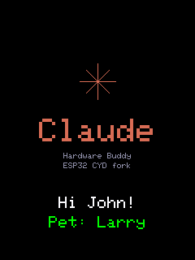<br>
      <sub><b>boot splash</b> — branding, then a per-owner greeting</sub>
    </td>
    <td align="center" width="50%">
      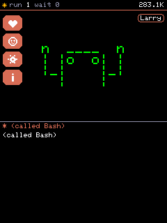<br>
      <sub><b>home</b> — status strip, pet, transcript HUD</sub>
    </td>
  </tr>
</table>

> **Community fork. Not affiliated with, endorsed by, or sponsored by
> Anthropic.** "Claude" and the Anthropic asterisk mark are trademarks
> of Anthropic, PBC, used here nominatively to identify the service
> this device integrates with. Firmware is MIT-licensed (see
> [`LICENSE`](LICENSE)); the brand identity is not.

See [`REFERENCE.md`](REFERENCE.md) for the wire protocol and
[`PORT.md`](PORT.md) for what changed vs the M5 original.

---

## Hardware

| | |
| --- | --- |
| **Board** | ESP32-2432S028R (USB-C variant) — single-core ESP32-WROOM, 4 MB flash, no PSRAM |
| **Display** | 2.8" ILI9341 320×240 LCD, run in 240×320 portrait (rotation 0) |
| **Touch** | XPT2046 resistive panel — 4-corner calibration on first boot, persisted to NVS |
| **Audio** | Speaker on GPIO 26 behind an active-low amp-enable on GPIO 4 |
| **LED** | RGB on 4 (red, shared with amp — unused) / 16 (green) / 17 (blue, attention) |
| **Battery** | TP4056-style LiPo charger on-board, optional JST PH2 cell |
| **BLE** | NimBLE 1.4 — Bluedroid was swapped out to free ~80 KB RAM and ~150 KB flash |
| **Missing** | No IMU, no AXP PMIC, no RTC chip — replaced with software stubs in `src/hal_m5.cpp` |

---

## Quick install (pre-built binary)

If you just want to flash a CYD without setting up the build
toolchain, grab the merged firmware image from the **[latest
release](https://github.com/jdperich/claude-desktop-buddy-cyd/releases/latest)**
and flash it at offset `0x0`.

You'll need [`esptool`](https://github.com/espressif/esptool)
(`pip install esptool`) and the device connected via USB.

```bash
# replace COMx (Windows) or /dev/ttyUSB0 (Linux/macOS) with your port
esptool.py --chip esp32 --port COMx write_flash 0x0 claude-desktop-buddy-cyd-vX.Y.Z.bin
```

The image is a single merged binary containing the bootloader,
partition table, and application — one flash, offset `0x0`, no
other files needed. LittleFS auto-formats on first boot if empty,
so the device will fall back to the built-in ASCII species pack
(no GIF assets pre-loaded — install custom packs later via
`pio run -e cyd -t uploadfs` if you want them).

**First boot** runs the touch calibration modal automatically.
Tap each of the four red crosshair targets in sequence; the
affine mapping is saved to NVS. Redo it later from **menu →
settings → calibrate**.

## Build from source

Install [PlatformIO Core](https://docs.platformio.org/en/latest/core/installation/),
then:

```bash
pio run -e cyd -t upload          # firmware
pio run -e cyd -t uploadfs        # only needed for custom GIF char packs
pio device monitor -e cyd         # serial console, 115200 baud
```

On Windows the CYD's USB-UART (CH340) typically enumerates as `COM10`
or similar — `pio device list` shows all serial ports.

To produce a merged binary for distribution (what the release
artifact is built from):

```bash
pio run -e cyd
esptool.py --chip esp32 merge_bin -o dist/claude-desktop-buddy-cyd-vX.Y.Z.bin \
  0x1000  .pio/build/cyd/bootloader.bin \
  0x8000  .pio/build/cyd/partitions.bin \
  0x10000 .pio/build/cyd/firmware.bin
```

---

## Pairing

1. In Claude for Windows/macOS: **Help → Troubleshooting → Enable
   Developer Mode**
2. **Developer → Open Hardware Buddy…**
3. Click **Connect**, pick `Claude-XXXX` from the list (XXXX = last
   two bytes of the device's BT MAC)
4. The link is **unencrypted** on this fork — NimBLE 1.4 ↔ WinRT
   couldn't negotiate a pairing handshake reliably across the
   configurations tested, so `setSecurityAuth(false, false, false)`
   and the chars are open. The protocol explicitly supports
   unencrypted devices; the desktop reports `sec: false` in the
   status panel.

---

## What it looks like

### Home & pet

The home screen runs the show: an always-on status strip at the top
(sparkle ✻ + `run N wait N` + 10-minute token sparkline + total
tokens today), four shortcut bubbles down the left rail, the
buddy/pet centred, a coral pill in the top-right with the pet's name,
a coral activity line showing what Claude is currently doing, and a
scrolling transcript HUD at the bottom.

<table>
  <tr>
    <td align="center" width="33%">
      <br>
      <sub><b>home</b><br>live status + transcript</sub>
    </td>
    <td align="center" width="33%">
      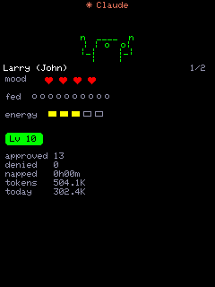<br>
      <sub><b>pet stats</b><br>mood / fed / energy / lifetime tokens</sub>
    </td>
    <td align="center" width="33%">
      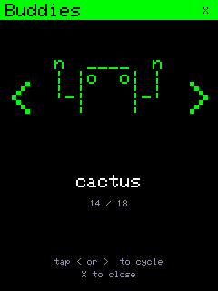<br>
      <sub><b>buddies</b><br>cycle through 18 ASCII species</sub>
    </td>
  </tr>
</table>

### Menus

Every overlay uses direct-tap rows with an X close badge in the
corner — no "tap left to move the cursor, tap right to change the
value" dance from the upstream stick UI. Each row is a button.

<table>
  <tr>
    <td align="center" width="33%">
      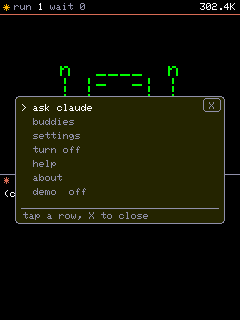<br>
      <sub><b>main menu</b><br>ask · buddies · settings · power · help · about · demo</sub>
    </td>
    <td align="center" width="33%">
      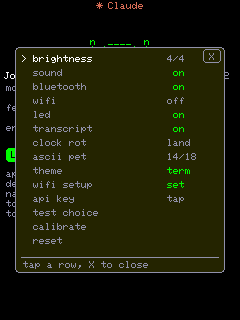<br>
      <sub><b>settings</b><br>brightness, sound, theme, wifi, api key, calibrate…</sub>
    </td>
    <td align="center" width="33%">
      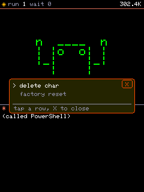<br>
      <sub><b>reset</b><br>delete character · factory reset</sub>
    </td>
  </tr>
</table>

### Prompts from the desktop bridge

When the desktop wants approval to run a tool, the device pops a
modal with the tool name, the action being requested, and a giant
**approve / deny** split-button. Multi-choice prompts get a
card-stack layout instead of yes/no — forward-compatible with a
future `prompt.choices[]` field in the wire protocol.

The screenshots use a deliberately silly demo payload — the real
prompts read like actual shell commands and tool calls.

<table>
  <tr>
    <td align="center" width="50%">
      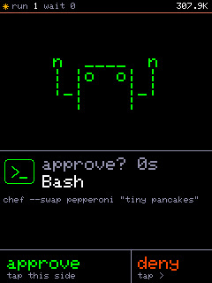<br>
      <sub><b>approval</b><br>tool icon + hint + green/coral buttons</sub>
    </td>
    <td align="center" width="50%">
      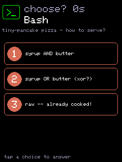<br>
      <sub><b>multichoice</b><br>tap a card to answer</sub>
    </td>
  </tr>
</table>

### Ask Claude (WiFi, no desktop)

When the desktop isn't around but WiFi + an Anthropic API key are
configured (entered via the on-device touch keyboard), the device
can hit `api.anthropic.com/v1/messages` directly with one of four
preset prompts and stream the reply into the transcript over SSE.

<table>
  <tr>
    <td align="center" width="50%">
      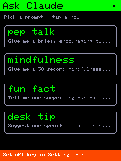<br>
      <sub><b>ask claude</b><br>four preset prompts, streamed reply</sub>
    </td>
    <td align="center" width="50%">
      <em>(stream lands directly in the home transcript HUD)</em>
    </td>
  </tr>
</table>

### Info pages

The Info section is a paginated read-only status book — tap the **i**
bubble on home to enter, tap right to advance, X to exit. Page 5
(sessions) and page 6 (device) update live from heartbeat events.

<table>
  <tr>
    <td align="center" width="25%">
      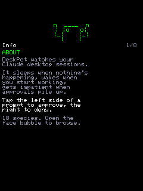<br>
      <sub><b>1/8 about</b><br>what the device does</sub>
    </td>
    <td align="center" width="25%">
      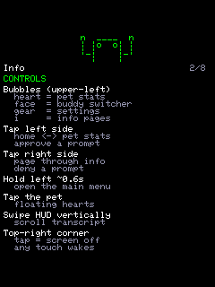<br>
      <sub><b>2/8 controls</b><br>full touch reference</sub>
    </td>
    <td align="center" width="25%">
      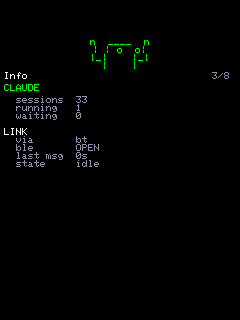<br>
      <sub><b>3/8 claude</b><br>session + BLE link state</sub>
    </td>
    <td align="center" width="25%">
      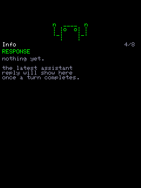<br>
      <sub><b>4/8 response</b><br>last assistant turn, in full</sub>
    </td>
  </tr>
  <tr>
    <td align="center" width="25%">
      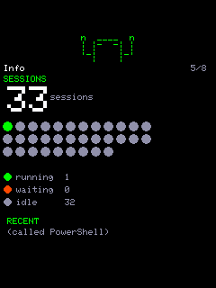<br>
      <sub><b>5/8 sessions</b><br>visual grid of running/waiting/idle</sub>
    </td>
    <td align="center" width="25%">
      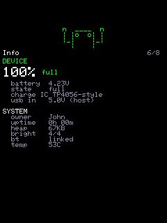<br>
      <sub><b>6/8 device</b><br>battery, heap, uptime, brightness</sub>
    </td>
    <td align="center" width="25%">
      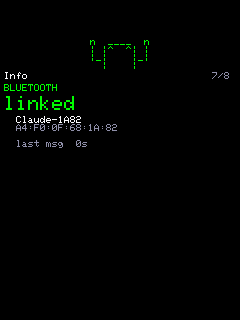<br>
      <sub><b>7/8 bluetooth</b><br>link state + MAC + last-msg age</sub>
    </td>
    <td align="center" width="25%">
      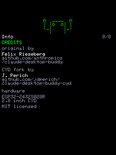<br>
      <sub><b>8/8 credits</b><br>upstream + fork + hardware</sub>
    </td>
  </tr>
</table>

---

## Features beyond upstream

- **Full 240×320 UI** — every hardcoded coord was reworked from the
  original 135×240 M5StickC layout
- **Touch-only controls** mapped to tap zones (left = A, right = B,
  hold-left = menu, top-right corner = power), plus on-screen bubble
  shortcuts down the left rail for **Pet stats / Buddies / Settings /
  Info**
- **Persistent status strip** at the top with run/wait counters, a
  10-minute token-activity sparkline, and today's total tokens
- **Live activity line** above the HUD showing the bridge's current
  `msg` field in Claude coral (`(called Bash)`, `generating reply`,
  etc.)
- **Built-in themes** — Claude Light, Claude Dark, Terminal — cycle
  from **Settings → theme**
- **Event-specific beep patterns** (approval ping, denial buzz,
  done-chord, etc.) routed through the LEDC tone driver
- **"Last response" Info page** showing the most recent assistant
  turn in full, captured from per-turn `text` events
- **Sessions Info page** with a visual grid breakdown of
  running/waiting/idle sessions
- **Tool icons** on the approval prompt — distinct glyphs for Bash,
  Read, Write, Edit, WebFetch, WebSearch, etc.
- **Multi-choice question UI** — card-stack modal that renders
  whenever the bridge sends `prompt.choices[]`; a test trigger in
  **Settings → test choice** exercises it today
- **Easter-egg idle animations** — speech bubbles, weekday/hour-gated
  jokes, and a "pet plays with the Claude logo" coral-sparkle particle
- **Touch keyboard** for entering WiFi credentials and an Anthropic
  API key — masked password input, shift / symbol modes, X to cancel
- **Standalone Ask Claude** — when paired, the bridge talks to
  Claude on the desktop; when not, the device can call the public
  API directly and stream the reply
- **Custom partition table** — 2.25 MB factory app + 1.66 MB
  LittleFS for GIF character packs, auto-formatted on first boot
- **NVS-backed everything** — touch calibration, theme, owner, pet
  name, species, WiFi creds, API key

---

## Touch controls

Resistive touch needs calibration to align panel coords to screen
coords; the affine basis is captured on first boot and stored in NVS
under the `tcal` namespace. Once that's done:

| Action | Where |
| --- | --- |
| Approve / next screen | Tap left side |
| Deny / page through info | Tap right side |
| Open menu | Hold left side ~0.6 s |
| Floating hearts | Tap the pet |
| Scroll transcript | Swipe up/down in the HUD |
| Screen off / wake | Tap top-right corner / tap anywhere |
| Pet stats | Heart bubble (upper-left column) |
| Switch buddy species | Face bubble |
| Open settings | Gear bubble |
| Open info pages | "i" bubble |

---

## Project layout

```
src/
  main.cpp           — loop, state machine, UI screens
  buddy.{cpp,h}      — ASCII species dispatch + render helpers
  buddies/           — one file per species, seven anim functions each
  character.{cpp,h}  — GIF decode + render
  ble_bridge.cpp     — Nordic UART service over NimBLE
  data.h             — wire protocol parser + tooling dispatch
  xfer.h             — folder-push receiver
  stats.h            — NVS-backed stats, settings, owner, species
  hal_m5.{h,cpp}     — CYD-backed M5 API shim (the heart of the port)
  touch_keyboard.cpp — on-device QWERTY keyboard widget
  ask_claude.{h,cpp} — standalone Anthropic API client over WiFi
  wifi_creds.h       — NVS storage for SSID, password, API key
tools/
  snap.py            — pull a pixel-perfect PNG screenshot over USB
  sim.py             — inject synthetic taps/swipes over USB
  capture_readme.py  — one-shot README screenshot orchestrator
PORT.md              — architecture rationale, what changed vs M5
partitions.csv       — custom layout (2.25 MB app + 1.66 MB LittleFS)
characters/          — example GIF character pack (bufo)
docs/                — README screenshots (auto-generated)
```

---

## Acknowledgments

- **[anthropics/claude-desktop-buddy](https://github.com/anthropics/claude-desktop-buddy)** —
  the original M5StickC Plus reference firmware by Felix Rieseberg.
  The wire protocol, the buddy concept, and the ASCII species
  rendering all come straight from upstream.
- **[vthinkxie/claude-desktop-buddy-esp32](https://github.com/vthinkxie/claude-desktop-buddy-esp32)** —
  a separate ESP32-S3 AMOLED fork that's a useful comparison point
  for board-HAL structure and a software-RTC pattern.
- The **bufo GIF assets** in `characters/bufo/` come from the
  community bufo emoji set ([bufo.zone](https://bufo.zone)) and
  remain the property of their original creators; not covered by
  the MIT license. See `characters/bufo/README.md`.

---

## License

MIT — see [`LICENSE`](LICENSE).

```
Copyright 2026 Anthropic, PBC.       (original upstream)
Copyright 2026 J. Perich.            (CYD port additions)
```

The Claude name and any visual references to Anthropic's brand
identity are not licensed under MIT and remain the property of
Anthropic, PBC.
